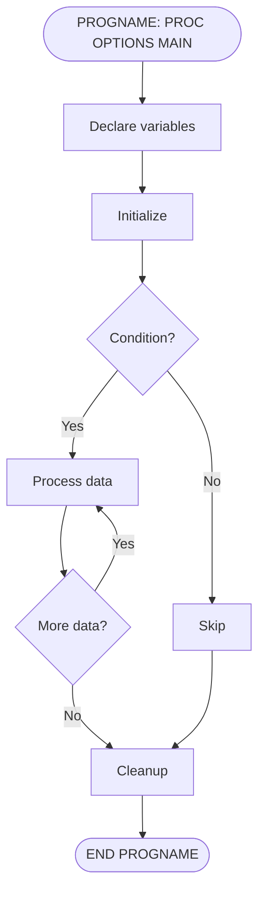
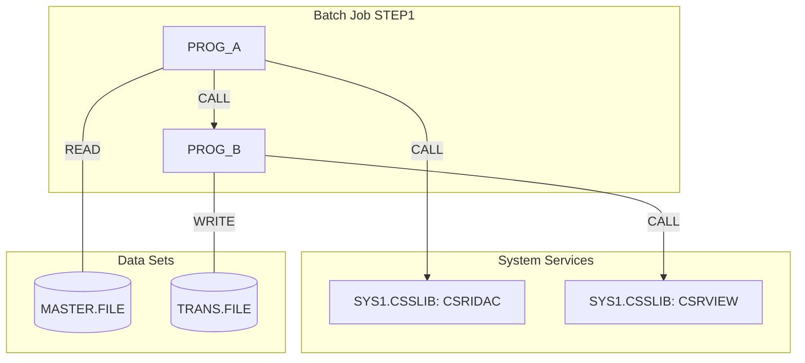
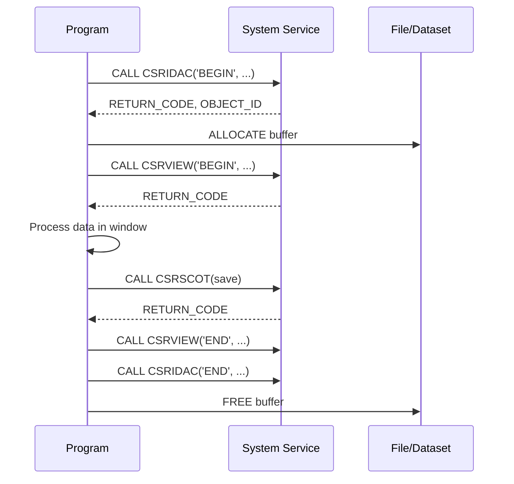

# Diagrams Skill

Use this skill when generating Mermaid diagrams for PL/I program analysis.

## Mermaid Diagram Types

### 1. Control-Flow Diagrams (`flowchart TD`)

For visualizing program logic within a single program.



### 2. Dependency Diagrams (`graph TD`)

For visualizing relationships across programs.



### 3. Sequence Diagrams (`sequenceDiagram`)

For visualizing the order of operations and external calls.



## Node Naming Conventions

| PL/I Element | Node Format | Example |
|-------------|-------------|---------|
| Procedure entry | `([NAME: PROC])` | `([CRTPLN3: PROC OPTIONS MAIN])` |
| Procedure exit | `([END NAME])` | `([END CRTPLN3])` |
| Assignment/computation | `[description]` | `[Calculate page boundary]` |
| Decision (IF) | `{condition}` | `{ORIG ¬= 0?}` |
| External CALL | `[[PROC_NAME]]` | `[[CSRIDAC]]` |
| File I/O | `[(operation)]` | `[(READ MASTER)]` |
| Loop start | `{loop condition}` | `{I <= NUM_WIN_ELEM?}` |
| ON-unit handler | `>condition]` | `>ENDFILE]` |
| ALLOCATE/FREE | `[ALLOC/FREE var]` | `[ALLOC S]` |

## Styling

```mermaid
%%{init: {'theme': 'base', 'themeVariables': {'primaryColor': '#e1f5fe', 'primaryTextColor': '#01579b', 'primaryBorderColor': '#0288d1', 'lineColor': '#0288d1', 'secondaryColor': '#fff3e0', 'tertiaryColor': '#f3e5f5'}}}%%
```

### Class Definitions for Color-Coding
```
classDef entryExit fill:#c8e6c9,stroke:#2e7d32,color:#1b5e20
classDef decision fill:#fff9c4,stroke:#f9a825,color:#f57f17
classDef io fill:#e1f5fe,stroke:#0288d1,color:#01579b
classDef error fill:#ffcdd2,stroke:#c62828,color:#b71c1c
classDef external fill:#f3e5f5,stroke:#7b1fa2,color:#4a148c
```

## Complexity Guidelines

- **< 10 statements**: Single flowchart
- **10–30 statements**: High-level + one detailed flowchart
- **30–100 statements**: High-level + per-section detailed flowcharts
- **> 100 statements**: High-level + per-procedure flowcharts + sequence diagram for external calls
