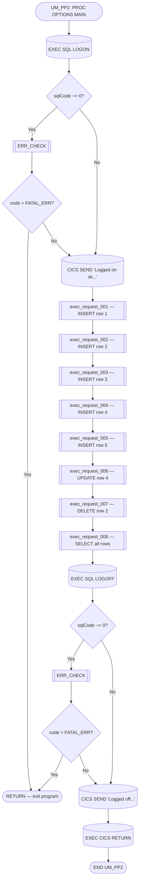
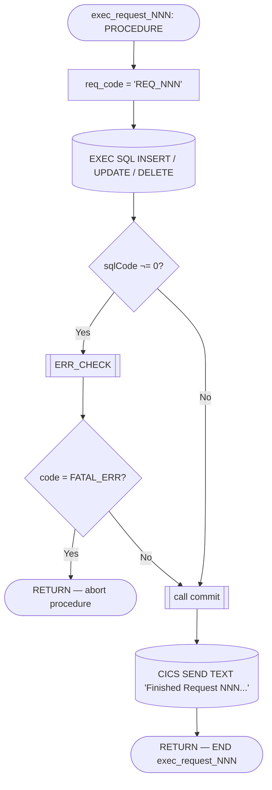
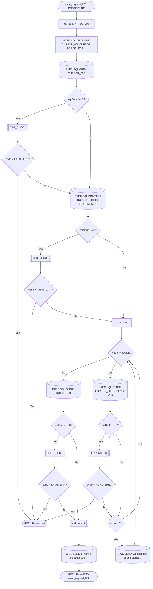
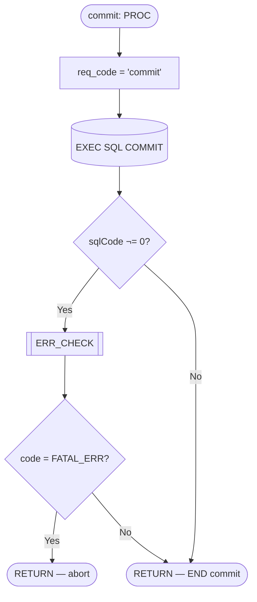
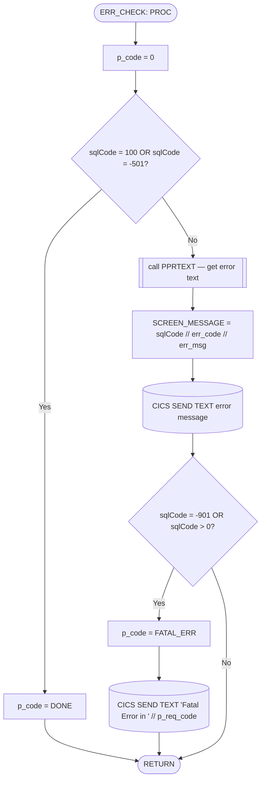

# UM_PP2 — Control Flow

## High-Level Flow

## Detailed Flow — Request Procedures 001–007 (Common Pattern)

Each of `exec_request_001` through `exec_request_005` (INSERT), `exec_request_006` (UPDATE), and `exec_request_007` (DELETE) follows this identical control-flow pattern:

### SQL Operations per Procedure

| Procedure | SQL Operation | Description |
|-----------|---------------|-------------|
| `exec_request_001` | `INSERT INTO HUTESTRESULTS` | Insert row 1 — min boundary values |
| `exec_request_002` | `INSERT INTO HUTESTRESULTS` | Insert row 2 — max boundary values |
| `exec_request_003` | `INSERT INTO HUTESTRESULTS` | Insert row 3 — null columns |
| `exec_request_004` | `INSERT INTO HUTESTRESULTS` | Insert row 4 — null columns |
| `exec_request_005` | `INSERT INTO HUTESTRESULTS` | Insert row 5 — max boundary values |
| `exec_request_006` | `UPDATE HUTESTRESULTS SET ... WHERE ROWNUMBER = 4` | Update row 4 |
| `exec_request_007` | `DELETE FROM HUTESTRESULTS WHERE ROWNUMBER = 2` | Delete row 2 |

## Detailed Flow — exec_request_008 (SELECT with Cursor)

## Commit Procedure Flow

## Error Handling Flow — ERR_CHECK

## Flow Notes

1. **Sequential request execution**: The main procedure calls all 8 request procedures in strict sequence. There is no conditional skipping — if a procedure encounters a `FATAL_ERR`, it returns to the main flow, which continues to the next `call` statement (no early exit from the main sequence between requests).

2. **Error propagation is local**: Each request procedure checks `code` after `ERR_CHECK` and returns early only from *itself*. The main procedure only checks for `FATAL_ERR` after `LOGON` and `LOGOFF` — not after the individual request calls. This means a fatal error in one request procedure does **not** prevent subsequent requests from executing.

3. **ERR_CHECK return codes**:
   - `0` (OK) — sqlCode was non-zero but not a recognized end/fatal condition; execution continues
   - `-1` (DONE) — sqlCode 100 (no more rows) or -501; normal end-of-data
   - `-9` (FATAL_ERR) — sqlCode -901 (crash/recovery) or any positive sqlCode; caller should abort

4. **CICS interactions**: Every status message and error message is sent to the CICS terminal via `EXEC CICS SEND TEXT`. The program ends with `EXEC CICS RETURN` to hand control back to CICS.

5. **Cursor lifecycle in exec_request_008**: DECLARE → OPEN → POSITION → FETCH loop → CLOSE. The `POSITION TO STATEMENT 1` is technically redundant for a single-statement cursor but included for multi-statement compatibility.

6. **External call**: `PPRTEXT` is an external assembler-interface entry that retrieves Teradata error text from the `SQL_RDTRTCON` connection.
